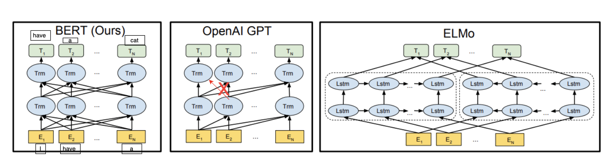
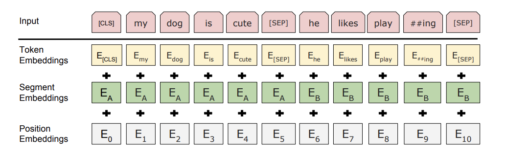

# BERT Quick Summary (Reminder Notes)

Paper: [BERT: Pre-training of Deep Bidirectional Transformers for Language Understanding](https://arxiv.org/pdf/1810.04805)
Why it matters: Established the pre-train-then-fine-tune paradigm and bidirectional context modelling that shaped an entire generation of NLP.

Gtihub page: https://github.com/google-research/bert

## What BERT is

- BERT = **Bidirectional Encoder Representations from Transformers**.
- Main idea: learn deep **bidirectional** language representations by pretraining a Transformer encoder, then fine-tune for downstream tasks.
- Unlike left-to-right models, BERT uses both left and right context during pretraining.

## Why BERT was important

- Before BERT, many methods were unidirectional (eitehr left-to-right or right-to-left) or shallowly bidirectional(like ElMO which train once left-to-right and once right-to-left and then concatenates the representations).

## Core architecture

- Uses only the **Transformer encoder** stack (no decoder).
- Two main sizes from the paper:
  - **BERT_BASE**: 12 layers, hidden size 768, 12 heads, ~110M params.
  - **BERT_LARGE**: 24 layers, hidden size 1024, 16 heads, ~340M params.

## Input representation (very important)

For each token, input embedding =

- Token embedding
- Segment embedding (sentence A vs sentence B)
- Position embedding

Special tokens:

- `[CLS]` at the start: final hidden state used for sentence-level classification.
- `[SEP]` between sentence pairs and at the end.

Example sentence pair format:

`[CLS] sentence A tokens [SEP] sentence B tokens [SEP]`

## Pretraining tasks

### A) Masked Language Modeling (MLM)

- Randomly select **15%** of tokens for prediction.
- For those selected tokens:
  - **80%** -> replace with `[MASK]`
  - **10%** -> replace with a random token
  - **10%** -> keep unchanged

Why this 80/10/10 trick matters:

- Reduces mismatch between pretraining and fine-tuning (because `[MASK]` does not appear at fine-tuning/inference time).

### B) Next Sentence Prediction (NSP)

- Train on sentence pairs:
  - **IsNext** (50%): B really follows A in corpus.
  - **NotNext** (50%): B is a random sentence.
- Helps tasks that need sentence-pair reasoning (e.g., QA, NLI).

## Limitations / caveats

- Encoder-only: great for understanding tasks, not directly autoregressive text generation.
- Full self-attention has $O(n^2)$ memory/time with sequence length.
- Original BERT max sequence length is 512 tokens.

## Fast recall checklist

- Bidirectional encoder pretraining
- Two objectives: MLM + NSP
- MLM uses 15% token selection and 80/10/10 replacement
- Input uses token + segment + position embeddings
- Special tokens: `[CLS]`, `[SEP]`
- Fine-tune end-to-end with small task head
- BASE vs LARGE sizes (110M vs 340M params)

# sources to help me understand the implementation of BERT: 

https://www.youtube.com/watch?v=ALrG7VCF8Gc&list=PLqL-7eLmqd9V3faivSAST76YQClS44dSz&index=12