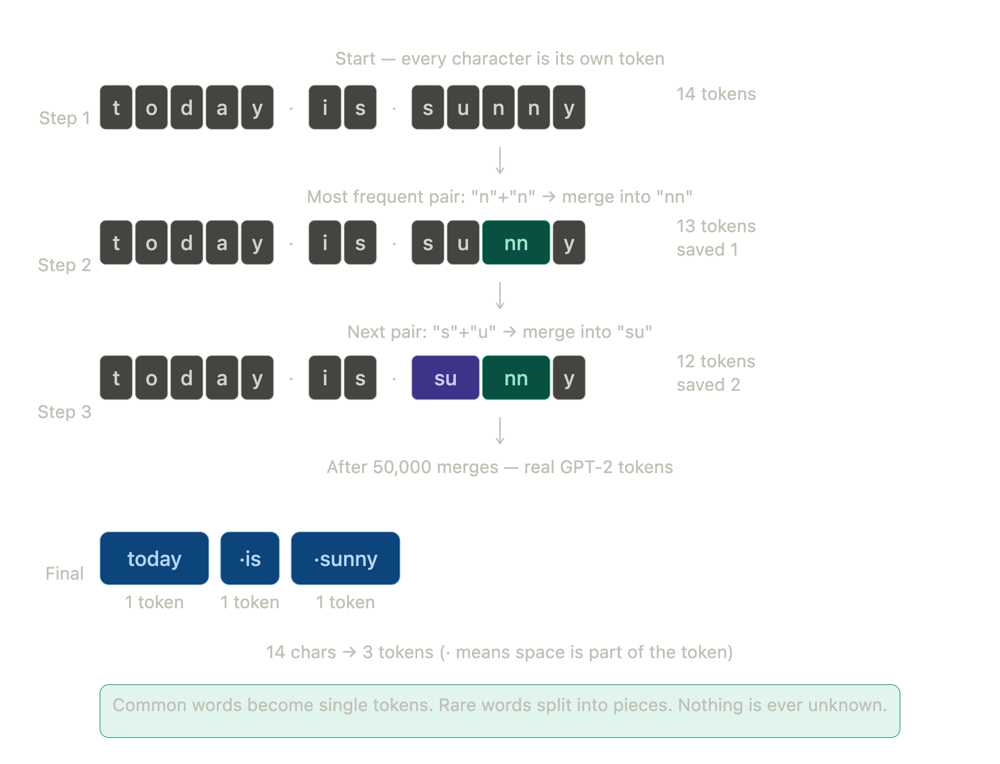

# GPT-2: Language Models are Unsupervised Multitask Learners

paper: https://cdn.openai.com/better-language-models/language_models_are_unsupervised_multitask_learners.pdf


github: https://github.com/openai/gpt-2

**Why it matters:** The paper demonstrated that scale plus next-token prediction yields emergent generalist capabilities without task-specific training.


## What is the Key Idea of this paper?

When LLMs trained on large and diverse corpus of text, they can perform a wide variety of language tasks without any explicit supervision or fine-tuning on those tasks (zero-shot performance).

This means that the model implicitly learns how to do tasks like question answering, reading comprehension, translation, and summarization simply by predicting the next word in large amounts of unlabeled text.


## What was the thought process behind this?

The authors built a large and diverse dataset (WebText) to train a very large transformer → they scale up to 1.5 billion parameters to allow enough capacity to capture and generalise from this complex dataset.

1. Previously, NLP systems only improved by training on large labeled, task-specific data → what's wrong then? They are inefficient in building a general purpose language understanding system
2. Move towards transfer learning and pre-training
3. The paper makes a hypothesis: **large language models learn to perform tasks via natural demonstrations** — since natural language text contains many implicit demonstrations of language understanding and reasoning (e.g., answering questions, summarizing, translations, commonsense reasoning), a large enough language model trained only to predict the next word over a huge and diverse dataset will implicitly learn to perform these tasks. They call this unsupervised multitask learning.
4. **Zero-shot evaluation on multiple tasks:** without any task-specific tuning or modification, they prompt the language model to perform various tasks by formulating inputs that reflect the task


## Data? what about it?

The key innovation of this paper is the data — it plays a crucial role in enabling zero-shot multitask learning capabilities of the model.

They scraped public web pages from the internet (around millions of web pages) and formed a large-scale and diverse corpus of naturally occurring text from many domains and contexts. They filtered by Reddit Karma score (a community-based metric of how interesting, useful, or high-quality a post or comment is considered by other Reddit users) → they indirectly collected higher quality and more meaningful text from a wide variety of domains.

The authors did not include explicit topic labels, task-specific annotations, or domain tags in the training data.

### Byte-Level BPE Tokenization

Rather than traditional word or subword tokenization, the model was trained with a byte-level representation that avoids lossy tokenization, enabling it to handle any text uniformly.

Traditional tokenization (word-level or BPE) requires preprocessing steps like lowercasing, tokenization rules, and handling out-of-vocabulary (OOV) words. Byte-level tokenization represents text as raw UTF-8 bytes → each byte is a token.

**Advantages:**
- Flexible: handles any text, non-standard characters, rare symbols, multiple languages, no OOV problem
- Robust: no language-specific rules, handles noisy input and novel words
- Learns from the rawest form of text

**Downside:** sequences get much longer → harder and less efficient to learn from

**The fix:** apply BPE (Byte Pair Encoding) on top of bytes → merge frequent byte sequences into single tokens. This interpolates between character-level and word-level, encoding frequent subword sequences as single tokens and rare ones at the character level. Best of both worlds — flexibility of byte-level + efficiency of subword tokenization.



## Architecture

Same decoder-only Transformer as GPT-1, but with changes focused on optimization and stability rather than fundamental redesign — needed because GPT-2 goes from 12 to 48 layers.

# What limitation GPT-1 had?

### Problem 1: Vanishing / Exploding Gradients

GPT-1 used Post-LN (LayerNorm after residual connection):
```
Input → Attention/FFN → Residual → LayerNorm
```

This works fine at small scale but at 48 layers, gradients have to flow through LayerNorm at every single layer during backprop:
```
Layer 48 gradient
  ↓ × LayerNorm Jacobian
Layer 47 gradient
  ↓ × LayerNorm Jacobian
Layer 46 gradient
  ↓ ...
```

By layer 10 the gradient is either near zero (vanishing → early layers learn nothing) or exploding → training collapses. Post-LN also makes deep transformers extremely sensitive to learning rate.

**Fix — Pre-LN:** move LayerNorm before attention and FFN:
```
Input → LayerNorm → Attention → Residual → LayerNorm → FFN → Residual → Output
```

Now gradients can flow directly back through the residual connection without passing through LayerNorm → even at 48 layers deep, early layers still receive meaningful gradients. An additional LayerNorm was also added after the final self-attention block.

### Problem 2: Residual Weight Initialization

GPT-1 initialized all weights the same way regardless of depth. Each residual adds variance σ², so:
```
GPT-1 with 12 layers: 12σ²  ← manageable
GPT-2 with 48 layers: 48σ²  ← activations blow up
```

**Fix:** scale residual weights by **1/√N** (N = number of residual layers) at initialization → mitigates variance accumulation → more stable training when scaling model depth.

```python
# Each residual projection initialized with:
weight = normal(0, 0.02 / sqrt(2 * num_layers))
```

### Other Changes

- **Context window:** 512 → 1024 tokens (better long-range dependencies, essential for zero-shot multitask)
- **Vocabulary:** expanded to 50,257 tokens
- **Batch size:** 512


## How is this different from other transformer-based architectures?

1. **Scale:** GPT-2 is much larger (1.5B parameters) compared to GPT-1 (117M), enabling it to better capture the complexity and variety of language tasks from raw text alone

2. **Dataset:** GPT-2 uses a novel large and diverse dataset of millions of web pages, exposing the model to many implicit task demonstrations in natural language. GPT-1 was trained on BookCorpus — a much more limited domain

3. **Zero-shot multitask:** while GPT-1 showed ability on some tasks via fine-tuning, GPT-2 shows strong zero-shot performance on a wider array of tasks without any fine-tuning or supervised task-specific training


## Very high level comparison

BERT sees the whole sentence at once, but GPT models are unidirectional — they can only see the left side (left-to-right). This makes BERT better at understanding (has full context while reading), whereas GPT is generative by design.

BERT always needs labeled data per task. GPT-1 also needs labeled data but less of it, and still requires fine-tuning. GPT-2 is zero labeled data, zero gradient update at test time.


### Architecture Comparison

| | BERT | GPT-1 | GPT-2 |
|---|---|---|---|
| Transformer type | Encoder only | Decoder only | Decoder only |
| Attention | Bidirectional | Causal (→ only) | Causal (→ only) |
| Parameters | 340M (large) | 117M | 1.5B |
| Context window | 512 tokens | 512 tokens | 1024 tokens |
| LayerNorm | Post-LN | Post-LN | **Pre-LN ← key** |
| Training objective | Masked LM + NSP | Causal LM | Causal LM |
| Vocab size | 30,000 (WordPiece) | 40,478 (BPE) | 50,257 (BPE) |