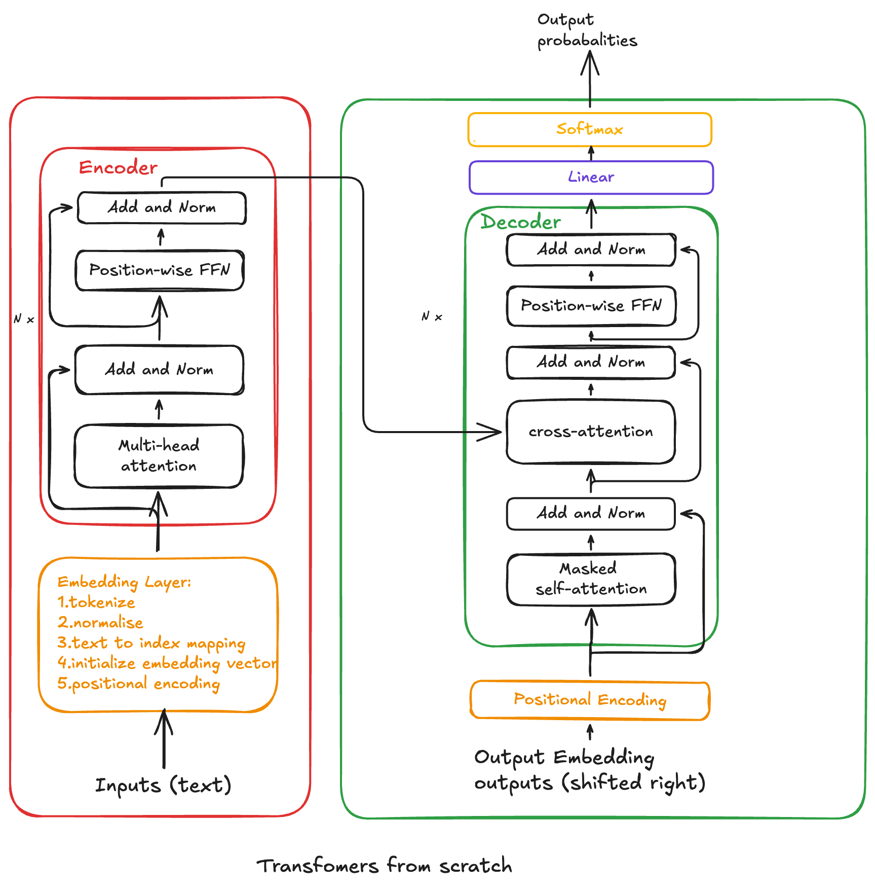

# Transformer From Scratch Study Notebook

This notebook is my hands-on study project for understanding the Transformer paper by rebuilding the core ideas step by step.

## What I Am Trying To Do

The goal of this notebook is to move from theory to implementation:

1. Understand each Transformer building block deeply.
2. Implement core components from scratch with NumPy first.
3. Rebuild a trainable version in PyTorch.
4. Test translation and language modeling behavior on small datasets.
5. Keep clear notes so I can explain every part of the architecture.

In short: this is practice for becoming an AI researcher by reproducing and understanding foundational work, not just reading it.

## Original Paper

- Attention Is All You Need (Vaswani et al., 2017): https://arxiv.org/abs/1706.03762

## Transformer Architecture

## Table of Contents

### Part 1: NumPy Foundations

1. Embedding Pipeline
2. Visualising Positional Encoding
3. Scaled Dot-Product Attention
4. Self-Attention Example
5. Inspecting Keys and Values
6. Multi-Head Attention Class
7. Add and LayerNorm
8. Add and LayerNorm Example
9. Position-wise Feed-Forward Network
10. Encoder Layer
11. Encoder Example
12. Decoder Layer
13. Encoder-Decoder Example
14. NumPy Transformer Assembly
15. Cross-Entropy Loss Function
16. NumPy Transformer Demo

### Part 2: Trainable PyTorch Version

17. Trainable Utilities for the PyTorch Version
18. Trainable Positional Encoding and Transformer Model
19. English to Persian Dataset Setup
20. Translation Training Loop
21. Translation Loss Plot and Greedy Decoding
22. Decoder-Only Language Model Setup
23. Language Model Training
24. Next-Token Generation Demo

## Files In This Folder

- transformers_from_scratch.ipynb: Main notebook for study, implementation, and experiments.
- architecture.png: Transformer architecture visual used in this README.
- requirenment.txt: Python package list for this folder.

## How To Use This Notebook

1. Run cells in order from top to bottom.
2. Start with NumPy sections to build intuition.
3. Continue to PyTorch sections for training and inference.
4. Use the translation section to test EN -> FA examples.
5. Use the decoder-only section to test next-token generation.
