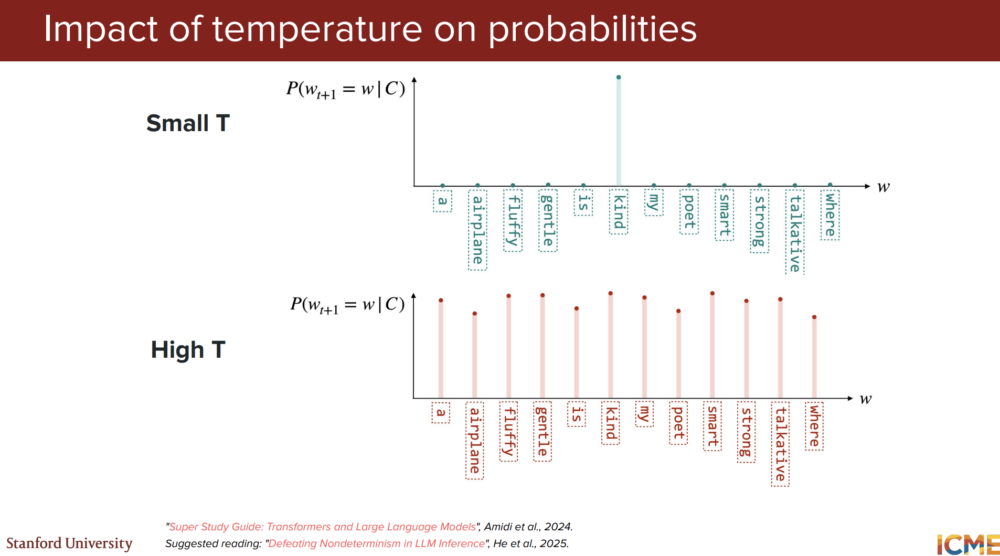

# CME295 Lecture 3 - Detailed Report

Source transcript: https://www.youtube.com/watch/Q5baLehv5So

## MoE Motivation: Capacity Without Full Activation

The lecture introduces MoE using a human-expert metaphor: if the question is mathematical, it is inefficient to consult every expert equally. Dense models activate all parameters each forward pass; MoE asks whether only a subset of experts can be activated per token.

### Dense MoE vs Sparse MoE

A generic MoE output can be written as a weighted sum of expert outputs:

$$
\hat{y} = \sum_{i=1}^{N} g_i(x) E_i(x)
$$

where $E_i$ is expert $i$ and $g_i(x)$ is gate/router weight for expert $i$.

Dense MoE uses all experts with nonzero weights.

Sparse MoE selects only top-$K$ experts:

$$
\hat{y} = \sum_{i \in \text{Top-}K(x)} g_i(x) E_i(x)
$$

This is the compute-saving regime used in modern LLM practice.

### Why Experts Are Placed in FFN Blocks

The lecture explains that the FFN sublayer is usually the largest per-layer parameter contributor, so replacing dense FFN with MoE FFN gives the largest compute-capacity leverage. In practice, experts are FFNs, routing is token-level, and different tokens in the same sequence can route to different experts.

### Routing Collapse and Load Balancing

A core training risk is routing collapse: the router repeatedly picks only a small subset of experts. To mitigate this, training adds an auxiliary load-balancing objective encouraging more uniform expert utilization (via token fractions and router probabilities per expert). Noisy gating is also mentioned as a practical exploration regularizer.

### Switch Transformer: Why It Matters

The lecture references Switch Transformer as a landmark sparse-MoE design because it demonstrates a very practical scaling recipe: increase model capacity by adding many experts, but keep per-token compute manageable with top-1 routing. In other words, each token is routed to a single expert (instead of combining many experts), which simplifies the routing path and keeps FLOPs closer to dense-model inference cost while dramatically increasing total parameter count.

The importance of this design is twofold. First, it showed that trillion-parameter scale can be reached with sparse activation rather than full dense activation. Second, it showed strong sample efficiency in practice: for similar training budgets, sparse expert models can reach target quality faster than comparably scaled dense baselines in many setups.

At the same time, Switch-style routing makes balancing mechanisms essential. If routing collapses to a few experts, most capacity becomes unused. So the practical recipe is not only top-1 routing, but top-1 routing plus explicit balancing strategies (auxiliary balancing loss, routing regularization, and implementation care for stable large-scale training).

### Key MoE Trade-Off

MoE can increase total parameters substantially (even into trillion-scale regimes) while keeping active parameters per token lower. This improves capacity and often sample efficiency, but introduces routing complexity and load-balancing challenges.

## Next-Token Generation: From Probabilities to Actual Output

After architecture, the lecture moves to decoding strategies. The model outputs a probability distribution over vocabulary tokens; generation quality depends on how we convert this distribution into actual token choices.

### Greedy Decoding

Pick the highest-probability token at each step. It is simple and fast but often low-diversity and locally optimal rather than globally optimal.

### Beam Search

Track top-$K$ sequence hypotheses over time (beam width $K$), expanding and pruning at each step by sequence score. This is more globally informed than greedy decoding and common in tasks like translation, but it can still reduce diversity and has higher compute/memory overhead.

The lecture also notes sequence-length bias in raw cumulative probability scoring, motivating length normalization adjustments in practical beam search.

### Sampling (Common for Chat LLMs)

Instead of always taking argmax, sample from the model distribution. This improves diversity and creativity.

Two common restrictions are discussed:

1. Top-$K$ sampling: sample only from the $K$ highest-probability tokens.
2. Top-$P$ (nucleus) sampling: sample from the smallest set of tokens whose cumulative probability exceeds threshold $P$.

## Temperature and Distribution Shape

The lecture then explains temperature-scaled softmax:

$$
p_i = \frac{\exp(z_i/T)}{\sum_j \exp(z_j/T)}
$$

where $z_i$ is logit for token $i$.

Interpretation:

1. Low $T$: distribution becomes sharper/spikier, favoring high-logit tokens.
2. High $T$: distribution flattens, increasing randomness and diversity.

The class walkthrough gives the limiting behavior:

1. $T \to 0^+$ concentrates mass near argmax token.
2. $T \to \infty$ approaches a near-uniform distribution.

Practical guidance from lecture:

1. Use lower temperature for deterministic/stable outputs.
2. Use higher temperature for creativity/diversity.

A systems caveat is highlighted: even at nominally deterministic settings, implementation-level nondeterminism can appear due to hardware and reduction-order effects.

## Guided Decoding for Structured Outputs

For constrained formats (for example JSON), the lecture contrasts a naive retry strategy with guided decoding. Guided decoding filters invalid next tokens during generation according to a constraint mechanism (for example FSM/grammar-style constraints), ensuring outputs follow required syntax during decoding rather than after-the-fact correction.

## Prompting and In-Context Learning

The second speaker reframes prompting as structured input design:

1. Context/setup.
2. Instructions.
3. Input payload.
4. Constraints.

### Context Length and Context Rot

Context length (window size) is reviewed as token budget per pass. Even with very long windows, retrieval fidelity can degrade with long/noisy contexts (context rot), especially under distractors. The practical recommendation is targeted retrieval of relevant context instead of blind context expansion.

### Zero-Shot vs Few-Shot

Few-shot prompting can improve task alignment by showing input-output patterns, but costs more tokens and may overconstrain behavior. The lecture notes an emerging trend where stronger instruction design and reasoning-oriented prompts can rival or exceed few-shot examples in some settings.

### Chain-of-Thought and Self-Consistency

Chain-of-thought prompting encourages intermediate reasoning before final answer, often improving reasoning metrics and debugging visibility. Self-consistency extends this by sampling multiple reasoning paths and majority-voting the extracted final answer, trading extra inference cost for robustness.

## Inference Efficiency: Exact and Approximate Techniques

The lecture organizes speedups into exact-equivalence optimizations and approximation-based optimizations.

### Exact/Systems-Oriented Attention Optimizations

#### KV Cache

In autoregressive decoding, keys/values for past tokens are reused instead of recomputed. This is central to practical latency reduction and applies at inference (not teacher-forced full-sequence training).

#### Attention Approximation: Sliding Window, Local, and Global Patterns

The lecture discussion also connects to a broader family of attention approximation methods used when full attention becomes too expensive for long contexts. Full attention scales as $O(n^2)$ in sequence length, so many practical systems restrict who can attend to whom.

The most common pattern is sliding-window (local) attention, where each token attends only to nearby tokens within a fixed window. This cuts compute and memory significantly, and with stacked layers the effective receptive field can still grow over depth.

A second pattern is local-global hybrid attention, where most tokens use local windows but selected tokens (or selected layers) use global attention. This keeps efficient local processing while preserving long-range information flow through global anchors.

The practical design intuition is:

1. Local attention gives lower cost and better scaling.
2. Global attention preserves cross-document or long-distance dependencies.
3. Interleaving local and global layers often gives a better quality-efficiency trade-off than using only one style.

This is why modern long-context model designs often combine approximation at the attention pattern level with systems optimizations such as KV caching and GQA.

#### GQA/MQA for Cache Size Reduction

Sharing K/V across groups or all heads lowers KV cache memory footprint while preserving strong quality-speed trade-offs.

#### Paged Attention and Memory Fragmentation

Naive reservation for full max context per request wastes memory. Paged attention allocates cache in fixed-size blocks, reducing internal and external fragmentation and improving serving throughput (as popularized in vLLM-style engines).

#### Multi-Latent Attention (MLA)

The lecture describes a compression-decompression idea for K/V representations via lower-dimensional latent spaces, including sharing compression structure across heads and between K/V components to reduce cache pressure while retaining quality.

### Approximate/Hybrid Generation Optimizations

#### Speculative Decoding

A small draft model proposes several tokens; the larger target model verifies/accepts with an acceptance-rejection mechanism and continues generation. This leverages the fact that batched verification on the large model can amortize latency while preserving target-like output behavior.

#### Multi-Token Prediction (MTP)

Instead of a separate draft model, additional prediction heads are attached so the same model proposes multiple future tokens. A verification/acceptance flow then advances decoding faster than strict one-token-at-a-time decoding.

## Paper and Reading Links Mentioned or Implied

1. Switch Transformer (sparse MoE at scale): https://arxiv.org/abs/2101.03961
2. Outrageously Large Neural Networks: The Sparsely-Gated Mixture-of-Experts Layer: https://arxiv.org/abs/1701.06538
3. vLLM / PagedAttention paper: https://arxiv.org/abs/2309.06180
4. DeepSeek-V2 (MLA discussion): https://arxiv.org/abs/2405.04434
5. Fast Inference from Transformers via Speculative Decoding: https://arxiv.org/abs/2211.17192
6. Self-Consistency Improves Chain of Thought Reasoning: https://arxiv.org/abs/2203.11171
7. Chain-of-Thought Prompting Elicits Reasoning in Large Language Models: https://arxiv.org/abs/2201.11903
8. Needle-in-a-Haystack style long-context evaluation references (for context retrieval stress tests):
	- https://arxiv.org/abs/2307.03172
	- https://arxiv.org/abs/2406.09079
9. Longformer: The Long-Document Transformer (sliding-window + global attention): https://arxiv.org/abs/2004.05150
10. Big Bird: Transformers for Longer Sequences (sparse/local-global patterns): https://arxiv.org/abs/2007.14062
=
