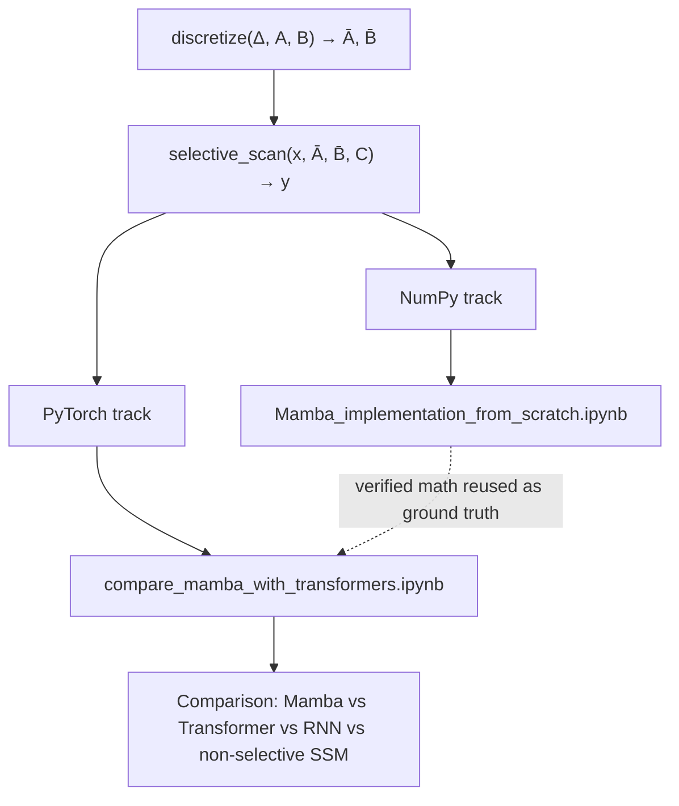
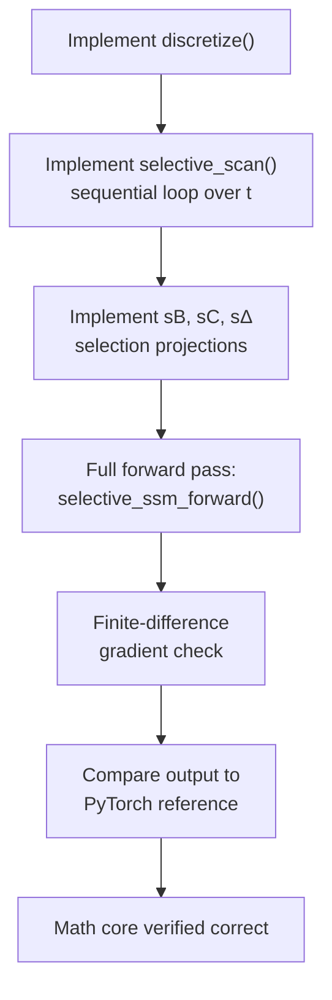
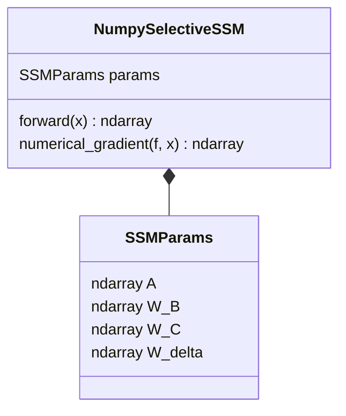
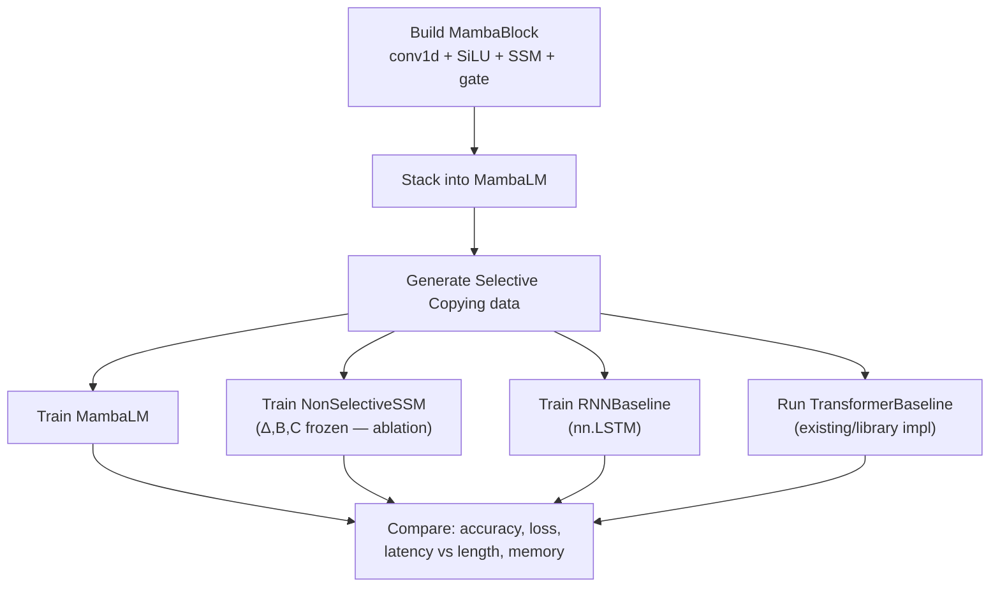
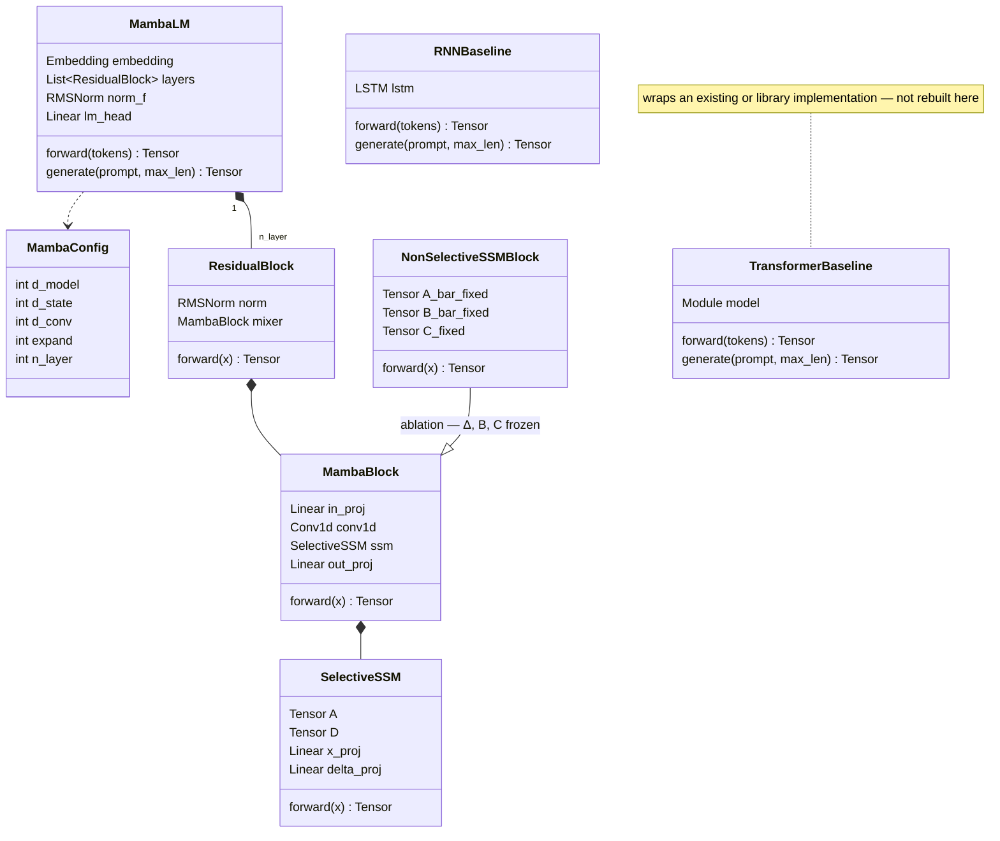

# Mamba implementation plan

Reference: [Gu & Dao, 2023 — arXiv:2312.00752](https://arxiv.org/pdf/2312.00752) · [state-spaces/mamba](https://github.com/state-spaces/mamba) · see also `mamba_paper_explained.md` in this repo for the full paper walkthrough.

I will use NumPy for implementing the pure math described in the paper (Mamba_implementation_from_scratch.ipynb).
PyTorch is for getting something that actually trains(comapre_mamba_with_transformers.ipynb).

The recurrence math (discretization + scan) is small and self-contained enough to write in NumPy.
Everything else (e.g. autograd, conv1d, the training loopis infrastructure), we don't need to reinvent, and we can use built in PyTorch implementation as its not the core focus of this repository (we onl care about the math behind papers)

We also aim to compare Mamba with Transformer, RNN, non-selective SSM that already exists only to demonstrate *why* Mamba's selection mechanism matters. 

## Two notebooks

| Notebook | Framework | Purpose |
|---|---|---|
| `Mamba_implementation_from_scratch.ipynb` | Pure NumPy | Prove the math is understood and correct — forward pass only, verified by gradient checking |
| `compare_mamba_with_transformers.ipynb` | PyTorch | A trainable Mamba, benchmarked against Transformer / RNN / non-selective SSM baselines |

## Overall plan



---

## Numpy Notebook — `Mamba_implementation_from_scratch.ipynb`

**Goal:**  is to implement the selective SSM in NumPy.

### Implementation plan

1. Implement `discretize()` — zero-order hold: Ā = exp(ΔA), B̄ = A⁻¹(Ā − I)B.
2. Implement `selective_scan()` — the sequential loop, hₜ = Āhₜ₋₁ + B̄xₜ, yₜ = Chₜ.
3. Implement the selection projections `s_B`, `s_C`, `s_delta` — small linear layers applied to xₜ.
4. Wire it into one full forward pass, `selective_ssm_forward()`.
5. Verify correctness with a **finite-difference gradient check** (perturb an input by ε, compare against the analytical derivative) — this stands in for a hand-written backward pass, which isn't needed here.
6. Cross-check outputs against the PyTorch version from Notebook 2, on identical inputs and weights, to confirm the two implementations agree numerically.

### Flowchart



### Functions

```python
# --- core math ---
def softplus(x) -> ndarray
def discretize(delta, A, B) -> tuple[ndarray, ndarray]        # → Ā, B̄
def selective_scan(x, delta, A, B, C) -> ndarray               # → y

# --- selection projections ---
def s_B(x, W_B) -> ndarray
def s_C(x, W_C) -> ndarray
def s_delta(x, W_delta) -> ndarray                             # softplus(Linear_1(x)), broadcast over D

# --- full forward pass ---
def selective_ssm_forward(x, A, W_B, W_C, W_delta) -> ndarray

# --- verification (not part of the model itself) ---
def numerical_gradient(f, x, eps=1e-5) -> ndarray
def check_gradients(analytical_grad, numerical_grad, tol=1e-4) -> bool
def compare_to_pytorch(numpy_output, torch_output, tol=1e-5) -> bool
```

### Class diagram

The internals stay functional (see above) — this is just a thin container for the learned parameters, so tests and the gradient checker have one object to pass around instead of five loose arrays.



---

## PyTorch Notebook — `compare_mamba_with_transformers.ipynb`

**Goal:** is to implement a real, trainable Mamba built in PyTorch, benchmarked against three baselines that isolate *why* selection matters:

- **Transformer** — full recall, no compression, O(L²). Uses your existing implementation or a library model (e.g. `nn.TransformerEncoder` or `transformers`), not rebuilt from scratch — this project's implementation effort is spent on Mamba, not on re-deriving attention.
- **RNN (LSTM/GRU)** — small fixed state, fixed compression rule, cheap but not content-aware. The classic pre-SSM baseline.
- **Non-selective SSM (S4-style)** — the same Mamba block architecture, but with Δ, B, C frozen instead of input-dependent. This is the paper's own ablation: it isolates *selection specifically* as the source of any quality gap, rather than some other architectural difference.

### Implementation plan

1. Build `MambaBlock` in PyTorch: causal conv1d → SiLU → selective SSM → gate, using `torch` ops so autograd tracks it.
2. Stack `MambaBlock`s into a full `MambaLM` (embedding → N blocks → LM head).
3. Build `NonSelectiveSSMBlock` as a light variant of `MambaBlock` — freeze Δ, B, C so they no longer depend on the input, reusing the same scan code.
4. Wrap `RNNBaseline` around `nn.LSTM`, and `TransformerBaseline` around your existing/library Transformer, both exposing the same `forward(tokens)` / `generate(prompt, max_len)` interface as `MambaLM`.
5. Generate the **Selective Copying** synthetic task data (the paper's own diagnostic — small, fast, and specifically designed to expose the gap between selective and non-selective models).
6. Train all four models on the same task and budget.
7. Benchmark and plot: task accuracy, training loss, inference latency vs. sequence length, and peak memory vs. sequence length.

### Flowchart



### Functions

```python
# --- data ---
def generate_selective_copying(n_samples, seq_len, n_tokens_to_remember) -> tuple[ndarray, ndarray]

# --- training ---
def train_step(model, batch, optimizer) -> float
def train_loop(model, data, n_epochs) -> list[float]

# --- benchmarking ---
def benchmark_latency(model, seq_lengths: list[int]) -> dict[int, float]
def benchmark_memory(model, seq_lengths: list[int]) -> dict[int, float]

# --- reporting ---
def plot_loss_curves(histories: dict[str, list[float]]) -> None
def plot_latency_vs_length(latencies: dict[str, dict[int, float]]) -> None
```

### Class diagram



---

## Suggested repo layout

```
.
├── README.md                                  ← this file
├── mamba_paper_explained.md                   ← paper walkthrough
├── Mamba_implementation_from_scratch.ipynb     ← pure NumPy
├── compare_mamba_with_transformers.ipynb       ← PyTorch + comparison
└── mamba_core/
    ├── numpy_ssm.py                            ← Notebook 1's functions, extracted
    └── torch_mamba.py                          ← Notebook 2's MambaBlock / MambaLM
```

## Definition of done

- ** Numpy Notebook:** `selective_scan()` output matches the PyTorch reference to within numerical tolerance, and the finite-difference gradient check passes.
- **PyTorch Notebook:** all four models train on Selective Copying; Mamba and the Transformer solve it, the non-selective SSM and RNN measurably don't (or solve it much worse) — reproducing the paper's core empirical claim on your own hardware, plus a latency-vs-length plot showing Mamba's near-flat inference cost against the Transformer's growth.