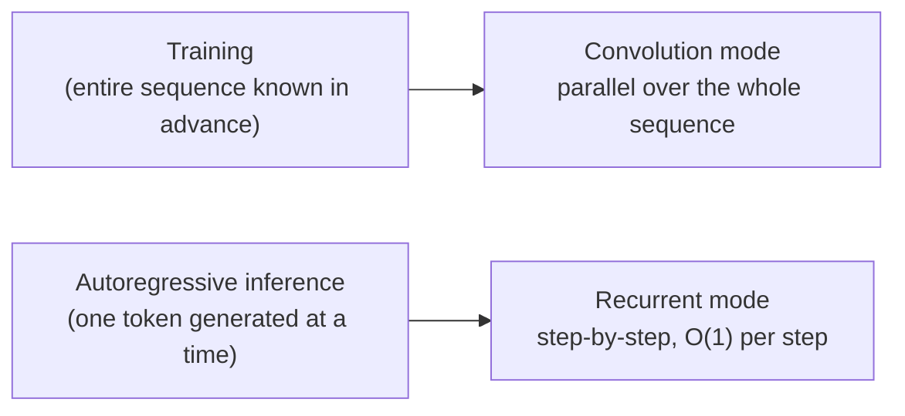
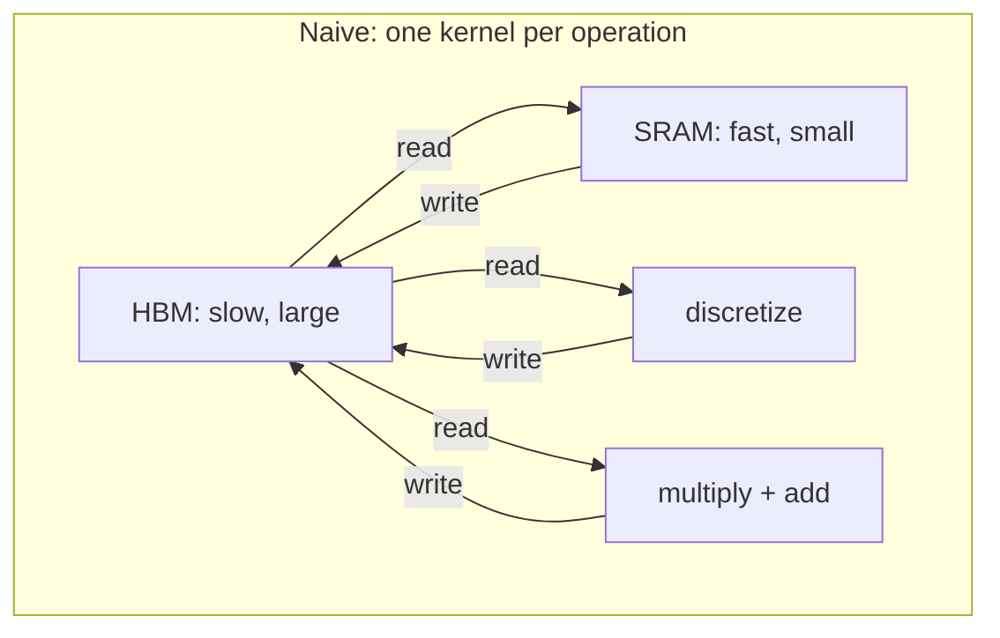
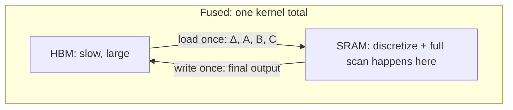
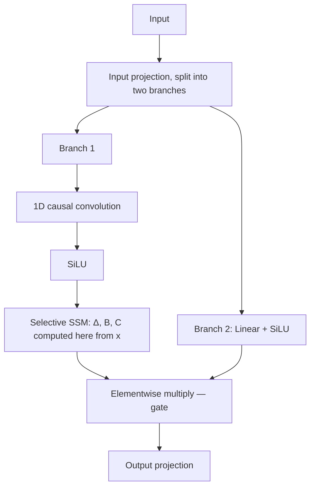

# Mamba: Linear-Time Sequence Modeling with Selective State Spaces

*A working explainer for implementing the paper from scratch (NumPy + PyTorch)*

Paper: [arXiv:2312.00752](https://arxiv.org/pdf/2312.00752) · Code: [state-spaces/mamba](https://github.com/state-spaces/mamba)

---

## TL;DR

Mamba takes the old idea of a state-space model — compress a sequence into a small, fixed-size hidden state instead of attending to every past token — and fixes the one thing that made earlier versions (like S4) weak: it lets the model's own update rule change based on the content of the current token, instead of using the same fixed rule at every position. That single change (*selection*) makes the model as content-aware as attention, but it costs the ability to train it as a simple parallel convolution, so the paper's second half is a hardware-aware scan algorithm that earns the speed back. Compared to a Transformer: same quality on language modeling, linear instead of quadratic cost in sequence length, and no KV cache at inference.

## 1. Why This Paper Exists

Transformers work extremely well, but self-attention costs **O(L²)** in sequence length L, because every token attends to every other token — the model looks at the entire sequence, at every single step. That's what gives Transformers their strength (nothing is ever thrown away, so recall is close to perfect), and it's also exactly what makes them expensive at scale.

State-space models (SSMs) are the competing lineage. Instead of keeping the whole history around, they compress everything seen so far into a small, fixed-size hidden state *h*. Generation becomes O(1) per step instead of attending back over everything. The problem: to make earlier SSMs (S4 and its relatives) *fast to train*, researchers forced them to be **linear time-invariant (LTI)** — the update rule (matrices A, B, C) stays exactly the same at every timestep, no matter what token is being processed. That constraint is what let the whole sequence be computed as one convolution instead of a step-by-step loop, and convolutions can be trained in parallel.

Mamba's core claim: **the LTI constraint is exactly what makes these models bad at content-based reasoning.** A fixed, input-independent update rule has no way to decide "keep this token" versus "ignore this token" based on what the token is — it treats every position identically. That's why LTI models fail at tasks that require noticing *what* a token is, not just *where* it is (more on this in Section 3).

So Mamba's fix is: make the SSM's parameters depend on the current input token. That one move is called **selection**. It solves the content-awareness problem — but it also breaks the convolution trick that made SSMs fast to train, since the "kernel" is no longer fixed and reusable across positions. The rest of the paper is spent earning that speed back with a custom, hardware-aware algorithm rather than a mathematical shortcut.

**One-sentence summary:** *selectivity for quality, a hand-engineered parallel scan for speed.*

---

## 2. Background: What a State-Space Model Actually Is

Before the selection mechanism makes sense, it helps to be clear on what an SSM is modeling in the first place, since this comes from control theory, not NLP.

### 2.1 The physical intuition

Think of tracking a moving car. At any instant, the car has a "state": its position, its speed, maybe its acceleration. Physics gives you a rule for how that state evolves — how position changes given speed, how speed changes given acceleration and force applied, and so on. Critically, in the real world this state changes *continuously*: there's no such thing as the car "jumping" from one position to the next, it flows.

```
 the car's real motion (continuous)              what a computer can ever track (discrete)

 position                                        position
    |                          .--''               |                        o
    |                     .-''                      |                    o
    |                 .-''                          |                o
    |            . -''                              |            o
    |        .-''                                   |        o
    |    .-''                                       |    o
    |.-''                                           |o
    +------------------------------------> time      +------------------------------------> time
      between any two instants there are               one snapshot every Δ seconds:
      infinitely many others — nothing is              h(t), h(t+Δ), h(t+2Δ), ...
      ever "in between two states"                      everything between two dots is
                                                          simply never computed
```

An SSM is the general mathematical object for exactly this situation: some hidden state *h(t)* that evolves continuously over time, driven by some outside input *x(t)* (like a force being applied), and producing some observable output *y(t)* (like a sensor reading).

### 2.2 The continuous equations

$$h'(t) = A\,h(t) + B\,x(t)$$
$$y(t) = C\,h(t)$$

Read *h′(t)* as "the rate of change of the state" — the derivative, i.e. how fast and in what direction the state is currently moving. The equation says: the state's rate of change depends on where the state currently is (through matrix *A*) plus how much the current input is pushing it (through matrix *B*). The output equation just says: read out the state through matrix *C* to get what you observe.

- **A** — the *transition* matrix. It's the rule for how the state evolves on its own, with no input: "given where I am, which direction do I drift?" Loosely, it answers "what should I keep, and what should fade?"
- **B** — maps the new input into the state: "what part of this new input is worth writing into memory?"
- **C** — maps the state back out to a prediction: "how do I use what I've stored to produce a good output right now?"
- **D** — a direct input→output skip connection (like a residual connection): "how much should the current input affect the output directly, bypassing the state entirely?"

### 2.3 Why we have to discretize

Computers don't operate on continuous time — they process discrete tokens, one at a time, at discrete positions 1, 2, 3, …, L. So the continuous equation above has to be converted into a discrete update rule: given the state at step *t−1*, how do I compute the state at step *t*? This conversion is called **discretization**, and it's governed by a new parameter, **Δ (delta)**, which represents the size of the time step between one position and the next — "how much time passed between token *t−1* and token *t*."

Mamba uses a specific, standard discretization method called **zero-order hold (ZOH)**. There are several ways to discretize an ODE; ZOH is simple and works well here because it assumes the input stays constant over each small interval Δ (a reasonable assumption when Δ is small).

```
 the real input x(t)                              what ZOH pretends x(t) looks like
 (free to wiggle at every instant)                (frozen for the whole window Δ)

      .-.        .--.                                ________            __________
     '   '      '    '                              |        |          |          |
   -'     '----'      '---                          |        |__________|          |____
                                                      |        |          |          |
   --+-------+-------+-------+--> t                  --+-------+-------+-------+--> t
     t     t+Δ     t+2Δ    t+3Δ                        t     t+Δ     t+2Δ    t+3Δ

     the true, continuous x(t)                        the ODE is solved on this flat
                                                        step for each window — this is the
                                                        only approximation ZOH makes
```

This is the one and only approximation in the whole derivation: freeze *x(t)* at its value *x(t)* for the entire window [t, t+Δ], then solve the ODE *exactly* over that window. Everything below follows from that single assumption — no other shortcuts are taken.

### 2.4 Deriving the discretization (zero-order hold), step by step

Starting from *h′(t) = Ah(t) + Bx(t)*, and assuming *x* is constant (equal to *x(t)*) over the interval [t, t+Δ]:

**Step 1 — multiply through by an integrating factor** *e^(−As)* and recognize a product rule:

$$\frac{d}{ds}\Big[e^{-As}h(s)\Big] = e^{-As}\big(h'(s) - Ah(s)\big) = e^{-As}Bx(t)$$

**Step 2 — integrate both sides** from *s = t* to *s = t+Δ*:

$$e^{-A(t+\Delta)}h(t+\Delta) - e^{-At}h(t) = Bx(t)\int_t^{t+\Delta} e^{-As}\,ds$$

**Step 3 — evaluate the integral** (it's just the antiderivative of a matrix exponential):

$$\int_t^{t+\Delta} e^{-As}\,ds = A^{-1}\big(e^{-At} - e^{-A(t+\Delta)}\big)$$

**Step 4 — multiply both sides by** *e^(A(t+Δ))* **and simplify**:

$$h(t+\Delta) = \underbrace{e^{\Delta A}}_{\bar{A}}\,h(t) + \underbrace{A^{-1}\big(e^{\Delta A}-I\big)B}_{\bar{B}}\,x(t)$$

That's it — this is exactly equation (4) in the paper (written with Δ distributed slightly differently, but algebraically identical). The result gives you a clean discrete recurrence:

$$h_t = \bar{A}\,h_{t-1} + \bar{B}\,x_t \qquad\qquad y_t = C\,h_t$$

This is the form you'll actually implement — it's just a linear RNN. **Ā** is the "how much of the old state survives" matrix, and **B̄** is "how much of the new input gets written in," both derived directly from the physical continuous-time parameters via Δ.

### 2.5 Quick symbol reference

| Symbol | Meaning | Fixed or learned? |
|---|---|---|
| *A* | continuous-time transition matrix | learned parameter, fixed structure |
| *Ā = exp(ΔA)* | discrete transition matrix — how much old state survives | derived from A and Δ |
| *B* | continuous-time input matrix | learned parameter (or, in Mamba, a function of xₜ) |
| *B̄* | discrete input matrix — how much new input gets written in | derived from A, B, Δ |
| *C* | output/readout matrix | learned parameter (or a function of xₜ) |
| *D* | skip connection, input directly to output | learned parameter |
| *Δ* | discretization time step | fixed in S4, a function of xₜ in Mamba |
| *h* | hidden state | computed at every step |
| *x, y* | input / output sequences | data |

---

## 3. The Actual Contribution: Selective State Spaces

### 3.1 Framing it as a compression problem

The paper frames the entire model landscape as a spectrum of how aggressively a sequence model compresses its context into a state:

| | State size | Compression rule | Cost | Content-aware? |
|---|---|---|---|---|
| **Attention (Transformer)** | grows with sequence — is, in effect, the *entire* past | no compression at all | O(L²) | yes, per-pair, explicitly |
| **Classic RNN / LTI SSM (S4)** | small, fixed | fixed, same at every step regardless of input | O(L) | **no** |
| **Selective SSM (Mamba)** | small, fixed | changes at every step, based on the current input | O(L) | **yes** |

Attention refuses to compress — every token can always look back at every other token's exact representation, so its "state" is really the entire history. That's why it has close to perfect recall, and also why it's expensive. Classic RNNs and LTI SSMs compress aggressively into a small state, which is cheap, but the *rule* for what gets kept versus discarded never changes, regardless of what's happening in the text — so they can't decide "this token matters, that one doesn't." Mamba's bet is that you can keep the small, cheap state *and* get content-awareness back, just by making the compression rule itself depend on the input.

### 3.2 The diagnostic tasks

Two synthetic tasks make the LTI weakness concrete:

- **Selective Copying** — the tokens that need to be remembered are placed at *random*, unpredictable positions in the sequence, with irrelevant filler tokens in between. In the plain version of this task (fixed positions), a model can cheat by simply counting position — "always copy whatever was in slot 1 through 5" — without ever looking at content. Randomizing the spacing removes that shortcut: the only way to solve it is to look at each token and decide whether it's one to remember or filler to discard. That's exactly the ability an LTI model lacks, since its update rule can't distinguish "important" from "filler" content.
- **Induction Heads** — look for the previous occurrence of the current token in the sequence, and copy whatever followed it. This requires context-aware lookup: "have I seen this before? What happened right after it, last time?"

LTI models fail both, provably, because Ā and B̄ never change based on content — the model applies the exact same filtering rule everywhere, so it structurally cannot implement "notice and remember this specific thing."

### 3.3 The fix: making Δ, B, C input-dependent

Instead of Δ, B, and C being fixed learned parameters, Mamba makes them small learned *functions* of the current input token:

$$B = s_B(x_t) = \text{Linear}_N(x_t) \qquad C = s_C(x_t) = \text{Linear}_N(x_t) \qquad \Delta_t = \tau_\Delta\big(\text{Linear}_1(x_t)\big)$$

where *τ_Δ* is softplus (keeps Δ positive). Put plainly: at every single timestep, a tiny linear layer looks at the current token and outputs a *fresh* B, C, and Δ for that step, instead of reusing the same ones everywhere. *A* itself stays a fixed, structured (diagonal) matrix — it doesn't become input-dependent directly — but because *Ā = exp(ΔA)*, and Δ is now input-dependent, *Ā* ends up input-dependent too, just indirectly.

**What Δ controls, intuitively:** it's the knob between "keep old state" and "overwrite with new input." This intuition relies on *A* being set up so it's stable — Mamba parameterizes *A* to have strictly negative eigenvalues, which is exactly what guarantees *Ā = exp(ΔA)* decays toward 0 as Δ grows, rather than blowing up or oscillating.

- Large Δ → *Ā = exp(ΔA)* shrinks toward 0 → *h_t ≈ B̄x_t* → the old state is mostly discarded, the new input dominates ("this token matters, reset and absorb it").
- Small Δ → *Ā ≈ I* → *h_t ≈ h_{t-1}* → the state barely changes ("this token is unimportant, keep coasting on what I already had").

That's how selection happens: not by comparing the current token to stored history the way attention does, but by modulating, at every step, how much of the state gets overwritten versus preserved, based only on the current token's own features.

**A necessary clarification on how "ignoring" a token works.** If a given token should be entirely ignored, all *D* channels of that token need to ignore it together — which is why *Δ* is first projected down to a single scalar, then broadcast across all *D* channels, rather than each channel getting its own independent Δ. This broadcast is **across channels at one timestep**, not across time: a fresh Δ is computed independently at every position from that position's own input, so nothing about a token is permanently tagged "unimportant" for the rest of the sequence. If the same concept reappears three paragraphs later, it gets an entirely new, independently-computed Δ at that new position.

There's a real limitation here, and it's honest to name it: once something *has* been compressed out of the finite-size state at position 5, Mamba has no way to go back and un-forget it at position 500, even if it turns out to matter again — it's a one-pass, streaming decision, with no revisiting. Attention doesn't have this problem, since it can always look back at position 5's exact stored key/value no matter what happened since, at the cost of storing everything. This is the unresolved tradeoff between the two approaches, and it's a large part of why the strongest production systems mix a few attention layers into an otherwise-Mamba model (see closing note).

### 3.4 The consequence: losing the convolution trick

Because Ā and B̄ (and C) now change at every timestep, the model is no longer LTI. That means the trick S4 relied on — unrolling the fixed recurrence into a single precomputed convolution kernel and training via FFT — no longer applies. You're stuck with a truly sequential recurrence: *h_t* depends on *h_{t-1}* through parameters that themselves change every step, so there's no way to precompute a fixed kernel ahead of time. Section 3.3 of the paper (and Section 5 below) is entirely about how to make that sequential recurrence fast anyway, without falling back to a naive, slow loop.

---

## 4. Two Computation Modes

Every SSM (selective or not) can be computed two different ways, and Mamba deliberately uses both, at different times:



- **Convolution mode** is used during training, where the whole input sequence is known ahead of time — it's parallelizable across the sequence dimension.
- **Recurrent mode** is used during autoregressive generation, where tokens are only seen one at a time and the model must produce the next token before seeing the one after it.

Computing the recurrence directly, per batch (*B*), sequence length (*L*), channel dimension (*D*), and state size (*N*), applied independently per channel, costs **O(B·L·D·N)** time and memory. This is the fundamental efficiency bottleneck the rest of the paper addresses.

---

## 5. Making the Selective Scan Fast: The Systems-Engineering Half of the Paper

This is where Mamba stops being a math paper and becomes a GPU-engineering paper. It's not required to understand the *math* you'll implement in NumPy, but it's the part that makes Mamba practical at scale, and the engineering behind it is genuinely clever.

### 5.1 The FLOP count is not the actual bottleneck

Naively, the sequential recurrence costs **O(B·L·D·N)** FLOPs, while the old convolution-based approach cost **O(B·L·D·log L)** — but with a much smaller constant factor. For realistic state sizes (*N* around 16–64) and long sequences, the recurrent approach can actually win on raw FLOPs even before any parallelism tricks are applied.

But FLOP count isn't where the real cost lives. GPUs have two tiers of memory:

- **HBM** (high-bandwidth memory) — large capacity, but comparatively slow.
- **SRAM** — tiny capacity, but extremely fast (on-chip, right next to the compute cores).

Most operations here are not limited by how fast the GPU can multiply numbers — they're limited by how fast it can move data back and forth between HBM and SRAM. Materializing the full state tensor of shape (B, L, D, N) in HBM, one operation at a time, means constant slow round trips. *That's* the actual bottleneck.

### 5.2 The three fixes





1. **Kernel fusion.** Instead of writing every intermediate result (discretized Ā, B̄, each step's hidden state) back out to slow HBM, load the parameters (Δ, A, B, C) into fast SRAM *once*, perform the discretization *and* the entire scan inside SRAM, and only write the final output back to HBM at the end. This alone removes the vast majority of the memory traffic that was making the naive sequential version slow.

2. **Parallel scan.** The recurrence *h_t = Āh_{t-1} + B̄x_t* looks inherently sequential — step *t* needs step *t−1* — but it's mathematically associative, the same property that lets you compute a running sum (prefix-sum) in parallel. Using the same technique as a parallel prefix-sum (a "scan"), the recurrence can be computed with only **O(log L)** sequential *depth*, instead of *L* fully sequential steps, even though the total work is similar.

3. **Recomputation.** Backpropagation normally needs every intermediate hidden state saved from the forward pass, which is expensive to store for long sequences. Instead of storing them, Mamba just *recomputes* them on the fly during the backward pass, from the saved inputs — trading a bit of extra compute for a large memory saving.

**The payoff:** with these three fixes combined, the selective scan layer ends up with roughly the same memory footprint as an optimized Transformer using FlashAttention — despite doing input-dependent, sequential computation instead of a fixed, parallelizable convolution.

**For your implementation:** the pure-NumPy and reference-PyTorch versions don't need any of this — they'll do the honest, sequential `for t in range(L): h = A_bar[t] @ h + B_bar[t] @ x[t]` loop. That's mathematically identical to what the fused kernel computes; it's just missing the GPU-level cleverness that makes it fast at production scale.

---

## 6. Attention vs. Selectivity: Two Different Philosophies of "What Matters"

The two architectures decide what to focus on in genuinely different ways, even though they're often described with the same words — "attention," "selection," "focus" — as if they were doing the same thing.

**Attention's mechanism is explicit, pairwise, and inspectable.** A query token computes a dot product against every key token, softmax turns those similarities into normalized weights, and the output is a weighted sum over all the values. You can open the resulting weight matrix after the fact and see, for any pair of tokens, how much one attended to the other. This is close to *photographic memory done right*: nothing is ever discarded, so recall over the full context is close to perfect. It's extremely effective — but not efficient, since storing and comparing against everything scales quadratically.

**Mamba's mechanism is implicit, per-token, and not directly comparative.** There is no step where the current token is compared against stored past tokens the way a query is compared against keys. Instead, a small linear layer looks *only* at the current token and decides how much of the existing state to keep versus overwrite (via Δ), how much of the current input to write in (via B), and how to read the state back out (via C). Nothing is stored in a form you can inspect after the fact the way you can with an attention matrix — the decision is folded directly into the recurrence.

| | Attention (Transformer) | Classic RNN | Selective SSM (Mamba) |
|---|---|---|---|
| **State size** | grows with sequence length | small, fixed | small, fixed |
| **Compression rule** | none — nothing discarded | fixed, content-independent | learned, content-dependent |
| **Recall of the past** | near-perfect | poor — discarded info is gone for good | good for what's selected, but discarded info is also gone for good |
| **Training cost** | O(L²) | O(L), sequential | O(L), but needs a parallel scan trick to train efficiently |
| **Inference cost per step** | grows with context (KV cache) | O(1) | O(1) |
| **How "importance" is decided** | explicit similarity (dot product) between current and all past tokens | not decided — fixed rule regardless of content | implicit, learned gating of a token against itself, not against stored history |
| **Interpretability** | can inspect the actual attention weight matrix | — | no directly inspectable "importance" signal |

This is the core tradeoff of the whole paper: efficiency (small, cheap, fixed state) versus effectiveness (perfect recall, but expensive) — and Mamba's contribution is moving the small-state option much closer to the effective end of that spectrum, without fully closing the gap on tasks that need exact, arbitrary-distance recall.

---

## 7. How to Know the Selection Mechanism Is Actually Working

Since there's no inspectable weight matrix the way there is with attention, correctness of the selection mechanism can't be checked by looking at an intermediate value — it can only be checked behaviorally, in two ways:

1. **Synthetic diagnostics.** On Selective Copying and Induction Heads, the selective version (called S6 in the paper) solves both tasks nearly perfectly, while the non-selective S4 baseline fails — which isolates selection itself, rather than some other change, as the reason for the improvement.
2. **Downstream performance at scale.** If the learned selection were producing garbage, language modeling quality (perplexity, benchmark accuracy) would degrade rather than match or exceed a strong Transformer baseline.

### A quick note on perplexity

Perplexity is the standard metric used to evaluate how well a language model predicts held-out text — informally, "how surprised is the model, on average, by the actual next token." Lower perplexity means the model's predicted probability distribution puts more mass on the token that actually came next. It's used throughout the paper's language modeling results as the main quality signal.

---

## 8. Interpreting What Selectivity Buys You (Section 3.5 of the paper)

Beyond the raw mechanism, the paper describes three concrete properties that fall out of making Δ, B, C input-dependent:

- **Variable spacing / filtering out irrelevant tokens.** Because the model can set Δ small for tokens it judges unimportant, it can skip over noise — filler tokens, whitespace, irrelevant content — without letting it disturb the state. It doesn't have to process every token as if it mattered equally.
- **Filtering context.** Many sequence models struggle when given more context than they need — extra tokens can dilute or distract a fixed-size state. A selective model can, in principle, learn to *ignore* excess context that isn't relevant to the task at hand, instead of being forced to compress all of it in regardless.
- **Boundary resetting.** Sequences are often artificially stitched together — for instance, packing multiple unrelated documents into one training sequence for hardware efficiency, or naturally at episode boundaries in reinforcement learning. A selective model can learn to reset its state at these boundaries, treating the next document (or episode) as a fresh start instead of letting irrelevant state leak across a boundary it can't see.

There's also a nice theoretical result worth knowing (Theorem 1 in the paper): in a specific special case (state size N=1, A=−1, with the paper's particular choice of the Δ projection), the selective SSM recurrence reduces *exactly* to a classic gated update — the same form used in LSTMs and GRUs:

$$g_t = \sigma(\text{Linear}(x_t)) \qquad h_t = (1-g_t)h_{t-1} + g_t x_t$$

This tells you Mamba isn't some exotic new mechanism — it's the principled, continuous-time generalization of gating, with the state size *N* as a knob for how much memory beyond a simple forget/input gate you get.

---

## 9. The Mamba Block (Architecture)

Prior SSM-based architectures (like H3) sandwiched an SSM between separate gated branches and MLP blocks. Mamba simplifies this into one homogeneous block, repeated N times, with no separate attention or MLP layers at all:



1. The input is projected and split into two parallel branches (each expanded by a factor *E*, typically E=2).
2. **Branch 1**: a 1D causal convolution (to mix in a little local context before the SSM sees the token), then a SiLU activation, then the selective SSM itself — this is where Δ, B, C are computed from the post-convolution activations and the scan runs.
3. **Branch 2**: just a linear projection followed by SiLU — this becomes a multiplicative gate.
4. The two branches are combined by elementwise multiplication, then projected back down to the model dimension.

No separate feed-forward block, no interleaving of attention and MLP the way a Transformer does — the whole network is just this one block, stacked repeatedly.

---

## 10. Summary Table: What Each Section Gives You

| Paper section | What it contributes | Needed for your implementation? |
|---|---|---|
| §2 (Background) | Continuous SSM, discretization (ZOH), recurrent vs. convolutional form | Yes — this is the mathematical core |
| §3.1–3.2 (Selection) | Making Δ, B, C functions of the input | Yes — the actual "Mamba" idea |
| §3.3 (Efficient implementation) | Kernel fusion, parallel scan, recomputation | No — GPU engineering detail; a plain loop replicates the same math |
| §3.4 (Architecture) | The Mamba block: conv1d → SiLU → SSM, gated | Yes — needed for the full block, not just the SSM |
| §3.5 (Interpretation / gating theorem) | Connects selectivity to classic RNN gating | Good to understand, not required to code |
| §4 (Experiments) | Empirical validation on synthetic tasks, language modeling, DNA, audio | No — background context only |

---

## Closing Note: Where This Leads in Production

Pure Mamba is used in production (e.g. Mistral's Codestral Mamba), but the more common pattern is **hybrid**: mostly Mamba layers for cheap long-range compression, with a small number of attention layers mixed in for the cases where exact, arbitrary-distance recall actually matters (AI21's Jamba and Nvidia's Nemotron-H line both follow this pattern). That mirrors the tradeoff discussed in Section 6 above almost exactly — it's rarely "one or the other" once you're building something meant to ship.