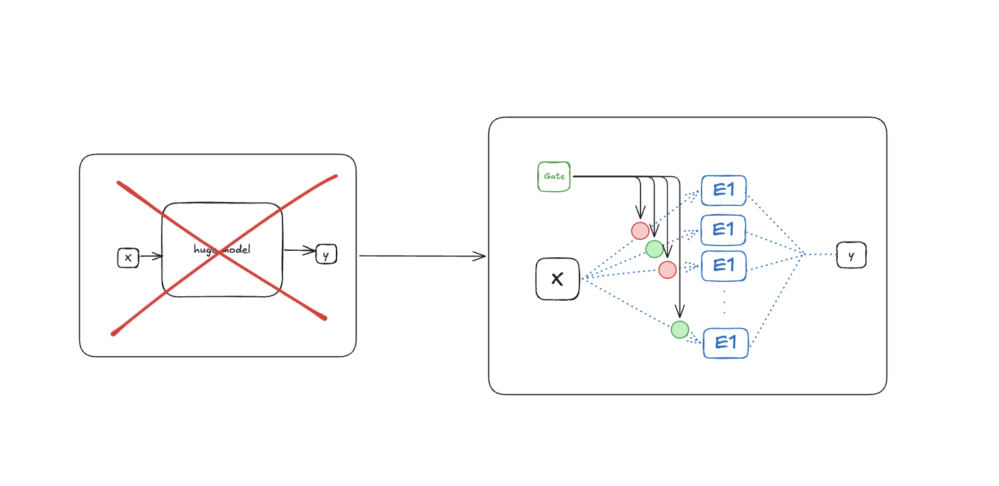

# Mixture of Experts (MoE)

**Paper:** [Mixture of Experts Meets Instruction Tuning](https://arxiv.org/abs/2305.14705) — Shen et al. (2023)

**Why it matters:** Sparse expert routing allows models to scale parameters without a proportional increase in compute cost — the architecture behind many frontier models.

## Key Idea

The paper proposes combining sparse Mixture-of-Experts (MoE) architectures with instruction tuning to efficiently scale LLMs without increasing inference costs.

Instead of routing every token through one large feed-forward network (FFN), the model maintains a pool of smaller expert networks and uses a learned gating mechanism to select the most relevant expert(s) per token.

## What was the though process behind this

- **Problem:** As LLMs grow larger, compute and memory demands increase proportionally, making training and deployment increasingly expensive.
- **MoE promise:** Sparse MoE architectures increase model capacity by maintaining many "experts" while only activating a small subset per token during inference — decoupling model capacity from computational cost.

---

## Model Architecture

- Built on a Transformer decoder backbone.
- Every other Transformer layer replaces the standard FFN with an **MoE layer** (becuase FFN is the most compute heavy part becase of all the ,atric projections)
- Each MoE layer contains multiple independent feed-forward networks ("experts").
- For each input token, only **1–2 experts are activated**, keeping inference cost low while capacity scales with the number of experts.
- Token routing creates a combinatorial space of $O(E^2)$ combinations per layer, enabling flexible specialization.

## Gating Mechanism

- A **learnable softmax classifier** predicts a probability distribution over experts for each token.
- The top-1 or top-2 experts are selected and their outputs are weighted and combined.
- Dynamic routing allows experts to specialize in different input patterns, improving both efficiency and overall capacity.

## Instruction Fine-Tuning Recipe

- FLAN-MoE is fine-tuned on a mixture of **1,836 instruction-following tasks** from Muffin, T0-SF, NIV2, and CoT datasets.
- Uses a **prefix language modeling objective** with all parameters updated.
- Key hyperparameters: sequence length (2048 input / 512 output), dropout 0.05, expert dropout 0.2, learning rate 1e-4.
- Auxiliary balancing losses from pretraining are retained to prevent expert collapse.

## Scaling & Experimental Findings

- **Expert count:** More experts improve performance up to a saturation point (64 experts for up to 32B models; 128 for larger).
- **Top-2 routing** outperforms top-1 by better leveraging expert diversity.
- **Instruction tuning** is significantly more effective than direct fine-tuning for MoE models, especially at larger scales or with limited task-specific data.
- **FLAN-MoE 32B** outperforms FLAN-PaLM 62B while using only ~⅓ of the inference FLOPs.

## Discussion Highlights

**Auxiliary Losses**
- Balancing losses prevent expert collapse and encourage load distribution across experts.
- The choice of loss type (balancing loss vs. router Z-loss) matters and can interact with the fine-tuning regime.

**Expert & Gating Freezing**
- Freezing the gating network or expert parameters during fine-tuning acts as a regularizer, improving generalization and training stability.

**Hyperparameter Sensitivity**
- Lower learning rates and smaller batch sizes yield more stable fine-tuning for large MoE models.

**Fine-tuning vs. Instruction Tuning**
- Direct fine-tuning on task-specific data underperforms dense baselines for MoE models.
- Instruction tuning closes this gap and mitigates common MoE overfitting issues.

**Expert Specialization**
- Larger FLAN-MoE models develop more pronounced specialization, with individual experts focusing on distinct tasks or input distributions.

- This division of labor leverages MoE capacity effectively by focusing experts on distinct facets of the problem.

- However, specialization can result in sensitivity to noise and reduced generalization to unseen tasks if not properly regularized.

**Limitations Noted**

- FLAN-MOE models fine-tuned primarily on English instructions underperform on multilingual benchmarks, suggesting over-optimization to English.

- Incorporating diverse linguistic data may be needed for improved multilingual capability.

# extra resources that helped me:
https://cameronrwolfe.substack.com/p/nano-moe

https://huggingface.co/blog/moe
