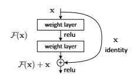
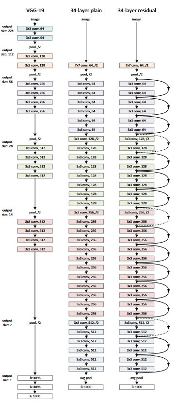

# Deep Residual Learning for Image Recognition (ResNet)

> **Paper:** [He et al., 2015 — arXiv:1512.03385](http://arxiv.org/pdf/1512.03385)

## Why ResNet Matters

ResNet is a landmark paper in computer vision. It solved the **performance degradation problem** that occurs when neural networks become very deep, using a mechanism called *skip connections*. The ideas introduced here remain the conceptual backbone of modern deep network training.

## Background: Convolutional Neural Networks

### What is a CNN?

Convolutional Neural Networks (CNNs) are designed to **extract features** from input data. Instead of using plain matrix multiplications, they apply *convolution operations* — the key idea being that learnable filters (kernels) scan across the input and identify local patterns and features.

### Key Concepts

**Filter / Kernel**
A small grid (smaller than the input) that slides across the input data. At each position, it computes the **dot product** between itself and the overlapping region of the input, producing a scalar output. This process detects specific patterns (edges, textures, shapes) depending on the learned filter values.

**Zero-Padding**
When a kernel extends beyond the boundary of the input, we pad the edges with zeros. This allows control over the spatial dimensions of the output and ensures border regions are processed fairly.

**Stride**
The stride defines how many steps the filter moves at each shift. A stride of 1 moves one position at a time; a stride of 2 skips every other position. **Increasing stride reduces the output spatial dimensions** — this is used deliberately in ResNets to downsample feature maps without a separate pooling layer.

## The Core Problem: Why Deeper Networks Fail

Deeper networks should — in theory — perform better, because more layers mean richer, more abstract feature extraction. However, in practice, naively stacking more layers causes two major problems:

### 1. Vanishing / Exploding Gradients

During backpropagation, gradients are multiplied repeatedly as they flow back through layers. In deep networks, these gradients can:

- **Vanish** → become extremely small, preventing early layers from learning
- **Explode** → become extremely large, causing unstable training

This is largely addressed today by **normalised weight initialisation** and **batch normalisation**, which allow networks of tens of layers to converge with SGD.

### 2. Degradation

Even after solving the gradient problem, a deeper problem emerges: as network depth increases, **accuracy saturates and then rapidly degrades** — even on the *training set*. This is counterintuitive: the extra layers are not overfitting; they are simply making optimisation harder. More parameters means a harder optimisation landscape.

> This degradation problem is what ResNet directly targets.

## The ResNet Solution: Residual Learning

### The Core Idea

Instead of asking each stack of layers to learn the desired underlying mapping $H(x)$ directly, ResNet reformulates the problem. The layers are asked to learn the **residual**:

$$F(x) = H(x) - x$$

So the true mapping becomes:

$$H(x) = F(x) + x$$

This is achieved by **adding the input $x$ directly to the output of the block**, bypassing the intermediate layers entirely. These bypasses are called **skip connections** or **shortcut connections**.

source: ResNet paper 

### The Residual Block

A basic residual block can be written as:

$$\mathbf{y} = \mathcal{F}(\mathbf{x}, \{W_i\}) + \mathbf{x}$$

where:
- $\mathbf{x}$ is the input to the block
- $\mathbf{y}$ is the output of the block
- $\mathcal{F}(\mathbf{x}, \{W_i\})$ is the residual mapping to be learned (e.g., two or three convolutional layers)
- The $+ \mathbf{x}$ term is the **identity shortcut connection**

For a two-layer block (the most common form):

$$\mathcal{F} = W_2 \cdot \sigma(W_1 \mathbf{x})$$

where $\sigma$ denotes ReLU activation.

source: ResNet paper 

### Why Does This Help?

If the optimal function for a block is close to an identity (i.e., the layer doesn't need to change the input much), it is much easier for the network to **push $F(x)$ towards zero** than to learn an identity mapping from scratch. The skip connection provides a direct gradient highway, making optimisation significantly easier.

Critically, shortcut connections **add no extra parameters and no extra computational cost** — the addition is a simple element-wise operation.

### Handling Dimension Mismatches

When the input and output dimensions differ (e.g., after a strided convolution increases the number of channels), a **linear projection** $W_s$ is used to match dimensions:

$$\mathbf{y} = \mathcal{F}(\mathbf{x}, \{W_i\}) + W_s \mathbf{x}$$

## Overall ResNet Architecture

A typical ResNet follows this structure:

1. **Initial Convolution + Pooling** — a single large convolutional layer (e.g., 7×7, stride 2) followed by max pooling to rapidly reduce spatial size
2. **Stages of Residual Blocks** — multiple stages, where within each stage the spatial resolution is constant; between stages, a strided convolution halves the resolution while doubling the number of filters
3. **Global Average Pooling** — collapses the spatial dimensions to a single vector
4. **Fully Connected Layer** — maps to the number of output classes

The key design pattern at each stage:
- Number of filters **increases** (deeper = more abstract features)
- Spatial resolution **decreases** (via strided convolutions)

## Experiments

The paper validates the residual learning framework on three benchmarks:

- **ImageNet** (large-scale image classification)
- **CIFAR-10** (small image classification)
- **COCO** (object detection)

ResNets of 34, 50, 101, and 152 layers were evaluated, with deeper variants consistently outperforming shallower plain networks — a direct demonstration that residual learning solves the degradation problem.

## Key Takeaways

| Concept | Summary |
|---|---|
| Degradation | Adding layers to a plain network hurts training accuracy |
| Vanishing gradient | Solved by normalisation; residuals make it even more robust |
| Skip connection | Adds input $x$ to block output: $H(x) = F(x) + x$ |
| What is learned | The *residual* $F(x)$, not the full mapping $H(x)$ |
| Parameter cost | Zero — shortcuts are free |
| Depth achieved | 152 layers on ImageNet; 1000+ on CIFAR-10 |

## Sources for Reading & Implementation

- **Original paper:** [Deep Residual Learning for Image Recognition](http://arxiv.org/pdf/1512.03385)
- **PyTorch implementation from scratch:** [DigitalOcean Tutorial](https://www.digitalocean.com/community/tutorials/writing-resnet-from-scratch-in-pytorch)
- **Accessible explainer:** [ResNets with Implementation — Medium](https://medium.com/@YasinShafiei/residual-networks-resnets-with-implementation-from-scratch-713b7c11f612)