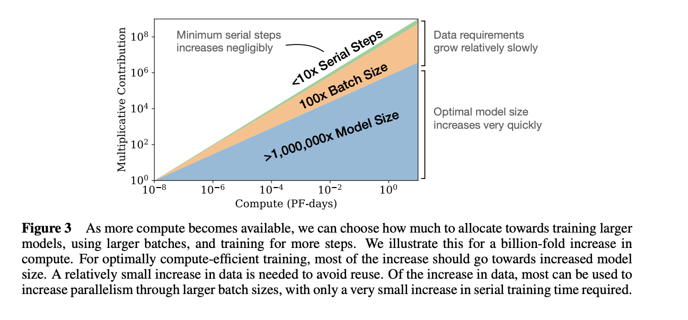

# Scaling Laws for Neural Language Models
## Engineering Reference Guide
**Kaplan, McCandlish et al. (OpenAI, 2020) — [arxiv.org/abs/2001.08361](https://arxiv.org/abs/2001.08361)**


## Overview

Accroding to the paper, language model performance follows predictable **power laws** which highly depends on scale which is across three axes: 
- **model size (N):** model praramters(non-embedding parameters only) - strongest one for performance, 
- **dataset size (D):** tarining tokens, and has sublinear growth needed vs N,
- **training compute (C):** which deteremines the optimal N/D tradeoff

> Architectural hyperparameters (depth, width, attention heads) have minimal effect compared to raw scale.

Larger models require fewer samples to reach the same performance.

# good plots from the paper


The paper illustrates, how the allocation of a vastly increased compute budget (up to a billion-fold increase) should be managed optimally to train language models most efficiently.
1. **primary allocation to larger mdoels:** When significantly more compute is available, the majority of this additional compute should be devoted to increasing the model size N—i.e., training much larger neural networks. The model size grows roughly as a power law N∝C0.73, meaning model size increases very rapidly with compute.

2. **Relatively small increase in data size:** 
To avoid overfitting, as model size increases, the corresponding increase in dataset size D needed is much smaller and grows sublinearly, roughly as D∝N0.74. This means data requirements grow relatively slowly compared to model size.

3. **Most data increase used for larger batch sizes (parallelism):**  The additional data can be leveraged primarily to increase batch size B during training, enabling more parallel processing of data and more efficient training without proportionally increasing training time.

4. **Minimal increase in serial training steps S:** The number of serial gradient update steps—essentially the length of sequential training—is only slightly increased (less than 10x even for a billion-fold increase in compute). This keeps overall training time manageable.
# cross-entropy loss

The paper uses cross-entropy loss

**Why cross-entropy loss?** It measures how well the model predicts the next token, quantifies the gap between true and predicted distributions, and captures learning progress cleanly across all scales.

## 1. Critical Batch Size

The paper, demonstrate the formula to calcualte he critical batch size. The critical batch size is the **sweet spot** for a given training loss. Below it we are wasting compute on noise reduction; above it we get diminishing parallelism returns.

### Formula

```
B_crit(L) = B* / L^(1/α_B)  =  (2 × 10⁸) / L^4.76
```

Where:
- `B* ≈ 2 × 10⁸` tokens
- `α_B ≈ 0.21` -> The paper does not define α_B as a clean standalone constant— it is the **exponent extracted from fitting B_crit vs L on a log-log plot**. The paper reports the exponent directly as ~4.8 (i.e. 1/0.21). Use the formula as:

```
B_crit = (2 × 10⁸) / L^4.8
```

- `L` = current cross-entropy loss


### B_crit at Common Loss Values

| Loss (L) | B_crit (tokens) | Sequences (seq_len=2048) | Phase |
|----------|-----------------|--------------------------|-------|
| 4.0 | ~138,000 | ~67 | Early training |
| 3.0 | ~365,000 | ~178 | Mid training |
| 2.0 | ~1,500,000 | ~732 | Late training |
| 1.5 | ~5,200,000 | ~2,539 | Near convergence |

### How to Calculate as an Engineer

**Step 1:** Read current loss from your training logs

**Step 2:** Plug into formula
```python
B_crit_tokens = 200_000_000 / (L ** 4.8)
```

**Step 3:** Convert tokens to sequences
```python
batch_size = B_crit_tokens / sequence_length
```

### Practical Notes

- **B_crit grows as loss falls** — increase batch size progressively through training (batch size warmup)
- The constant B* ≈ 2×10⁸ is calibrated to GPT-2-scale runs; measure gradient noise scale for your own domain
- Staying within 2–3× of B_crit is fine; the tradeoff degrades gradually, not sharply
- Hardware constraints often dominate — optimise for GPU efficiency first, then adjust toward B_crit

## 2. Performance vs Model Size (N) and Data (D)

### Core Power Law Formulas

Fix dataset size to be effectively unlimited (so the model never runs out of data), train each model to convergence, then measure loss. The only thing changing is N (number of parameters).
so in general -> every 10x increase in model size ->reduce loss around 15-16%
```
L(N) = (N_c / N)^α_N        [infinite data(model never runs out of data), vary N]

```

For larger models trained with limited dataset with ealry stopping

```
L(D) = (D_c / D)^α_D        [convergence, vary D]
```

### Constants

| Constant | Value | Meaning |
|----------|-------|---------|
| α_N | 0.076 | Loss exponent for model size |
| α_D | 0.095 | Loss exponent for dataset size |
| N_c | 8.8 × 10¹³ | Characteristic parameter scale |
| D_c | 5.4 × 10¹³ | Characteristic token scale |

### What the Exponents Mean in Practice

Both exponents are less than 1 — diminishing returns, but smooth and predictable.

**Every 10× more parameters** → loss reduction of `10^0.076 ≈ 1.19×`

| N (params) | Relative Loss |
|------------|--------------|
| 10M | 1.00 |
| 100M | 0.84 |
| 1B | 0.71 |
| 10B | 0.59 |
| 100B | 0.50 |

**Every 10× more tokens** → loss reduction of `10^0.095 ≈ 1.24×`

| D (tokens) | Relative Loss |
|------------|--------------|
| 1B | 1.00 |
| 10B | 0.81 |
| 100B | 0.65 |
| 1T | 0.53 |

### N vs D Tradeoff Under Fixed Compute

Since α_D > α_N (0.095 > 0.076), data scales slightly more efficiently per 10×. But under fixed compute `C ≈ 6ND`:

```
N_opt ∝ C^0.73     (model size)
D_opt ∝ C^0.27     (dataset size)
```

**Scale model size much faster than data.** This was later revised by Chinchilla (2022) — see Section 7.


## 3. Degree of Overfitting

Overfitting is governed by the ratio of model size to dataset size:

```
Overfitting ∝ N^(α_N / α_D) / D  =  N^0.8 / D
```

To avoid overfitting when scaling N, dataset size must grow roughly as **N^0.8**.

### The Safe Ratio Check

```
R = N / D^0.74
```

- **R large** → overfitting (too many params, too little data)
- **R small** → undertrained / unused capacity

### Example: 7B Parameter Model

```
N = 7×10⁹,  D = 1×10¹² tokens (1T)

D^0.74 = (10¹²)^0.74 = 10^8.88 ≈ 7.6×10⁸

R = 7×10⁹ / 7.6×10⁸ ≈ 9.2  →  mild overfitting

To reach R < 1: D > (7×10⁹)^(1/0.74) ≈ 3×10¹³ tokens  (30T!)
```

This is why modern models train on far more data than Kaplan's compute-optimal prescription.

### Overfitting Tolerance Table

| Overfitting Tolerance | Required Tokens per Param |
|-----------------------|--------------------------|
| < 10% excess loss | ~1,500 tokens/param |
| < 1% excess loss | ~15,000 tokens/param |
| < 0.1% excess loss | ~150,000 tokens/param |

### Measuring Overfitting as an Engineer

**Method 1: Val/Train Loss Ratio (quickest)**

```python
overfitting_ratio = val_loss / train_loss
```

| Ratio | Interpretation |
|-------|---------------|
| ~1.00 | No overfitting |
| 1.01 – 1.05 | Mild, acceptable |
| 1.05 – 1.15 | Moderate — consider more data |
| > 1.15 | Significant overfitting |

**Method 2: Log-log curve fitting**

Train at fixed N, vary D. Plot val loss vs D on log-log axes. The point where the curve flattens is your overfitting threshold. The gap between your val loss and the asymptote is your overfitting penalty.


## 4. Learning Curves

### Formula

```
L(N, S) = (N_c / N)^α_N  +  (S_c / S)^α_S
```

Where:
- `S` = number of parameter update steps
- `α_S ≈ 0.76`
- `S_c ≈ 2,100 steps`

The **first term** is the irreducible capacity floor (set by N). The **second term** is the reducible loss that decays with training steps.

### Loss Reduction per 10× More Steps

Every 10× more steps: `10^0.76 ≈ 5.75×` reduction in the reducible term.

| Steps | Reducible Loss Term |
|-------|---------------------|
| 1K | 1.00 |
| 10K | 0.17 |
| 100K | 0.030 |
| 1M | 0.005 |

> **Important:** This only holds until you hit the model's capacity floor (N term). After that, more steps give you nothing — you need a bigger model.

S_c ≈ 2,100 is very small, meaning almost all practical training happens in the power-law regime.

### Engineering Uses

**Predict loss at step S for model size N:**
```
L_target = L(N, ∞)  +  (S_c / S)^0.76
```

**Estimate steps needed for a target loss:**
```
S_needed = S_c × (1 / (L_target - L(N,∞)))^(1/0.76)
```

### Diagnosing Where You Are

| What You See on Log-Log Plot | Diagnosis | Fix |
|------------------------------|-----------|-----|
| Straight line, still falling | In power-law regime | Keep training |
| Line flattening | Approaching capacity floor | Bigger model needed |
| Completely flat | At N floor | Scale N, not steps |
| Line above predicted | Data quality / LR issue | Check pipeline & LR schedule |

### Learning Rate Scaling

```
η_opt ≈ 0.003239 / N^0.05
```

| Model Size | Approx Optimal LR |
|------------|------------------|
| 1B params | ~0.0030 |
| 10B params | ~0.0027 |
| 100B params | ~0.0024 |

Use cosine decay or 1-cycle schedules — they match the shape of the power-law learning curve. Constant LR wastes compute at the end of training.

---

## 5. How to Scale with Fixed Compute (Eq. 1.7 & 1.8)

### Equation 1.8: The Compute Exponent

```
α_C^min  =  1 / (1/α_S + 1/α_B + 1/α_N)
          =  1 / (1/0.76 + 1/0.21 + 1/0.076)
          =  1 / (1.32 + 4.76 + 13.16)
          =  1 / 19.24
          ≈  0.050
```

### Equation 1.7: How Each Quantity Scales with Compute C

```
N ∝ C^(α_C^min / α_N)     B ∝ C^(α_C^min / α_B)
S ∝ C^(α_C^min / α_S)     D = B × S
```

| Quantity | Exponent | 10× Compute → Growth | Meaning |
|----------|----------|----------------------|---------|
| N (model size) | 0.050/0.076 = **0.73** | 5.4× more params | Most compute goes here |
| B (batch size) | 0.050/0.21 = **0.24** | 1.7× bigger batch | Moderate growth |
| S (steps) | 0.050/0.76 = **0.03** | 1.07× more steps | Barely changes |
| D (dataset) | 0.24 + 0.03 = **0.27** | 1.9× more tokens | Slow growth |

### Dataset Growth vs Compute Growth

| Compute Scale-up | Dataset Growth Needed |
|------------------|-----------------------|
| 10× | ~1.9× |
| 100× | ~3.6× |
| 1,000× | ~6.7× |
| 1,000,000× | ~23× |

Dataset grows **extremely slowly** relative to compute. Most new compute should go into a bigger model, not more training time or more data.

## 6. Master Diagnostic Framework

The full loss decomposes into three independent terms:

```
L(N, D, S) = (N term)  +  (D term)  +  (S term)
               model        data        training
               floor        penalty     progress
```

Each term follows a power law independently. Your job as an engineer is to identify **which term is dominating** and fix that one.

| Dominant Term | Symptom | Fix |
|---------------|---------|-----|
| N (model floor) | Val ≈ train loss, both plateaued | Train a bigger model |
| D (data penalty) | Val > train loss, growing gap | Get more data |
| S (training progress) | Train loss still falling | Keep training longer |

### All Constants at a Glance

| Constant | Value | Used In |
|----------|-------|---------|
| α_N | 0.076 | Model size scaling, overfitting ratio |
| α_D | 0.095 | Data scaling, overfitting ratio |
| α_S | 0.76 | Learning curve (steps) |
| α_B | 0.21 | Critical batch size |
| α_C (min) | 0.050 | Compute allocation (Eq 1.7/1.8) |
| B* | 2 × 10⁸ tokens | Critical batch size formula |
| S_c | ~2,100 steps | Learning curve formula |
| N_c | 8.8 × 10¹³ params | L(N) power law |
| D_c | 5.4 × 10¹³ tokens | L(D) power law |

---

## 7. Chinchilla Update (2022)

Hoffmann et al. (DeepMind) re-ran the compute-optimal analysis more carefully and found:

- The Kaplan paper's optimal ratio trained models on **too few tokens per parameter**
- α_N ≈ α_D (roughly equal), not α_N < α_D as Kaplan suggested
- Compute-optimal training requires **~20 tokens per parameter** (not ~1–2 as Kaplan implied)
- The LLaMA series took this further: train small models on vastly more data for better inference efficiency

| Framework | N scaling | D scaling | Tokens/param (compute-optimal) |
|-----------|-----------|-----------|-------------------------------|
| Kaplan (2020) | C^0.73 | C^0.27 | ~1–2 |
| Chinchilla (2022) | C^0.50 | C^0.50 | ~20 |
| LLaMA approach | Small N fixed | Large D | ~1000+ |

> Kaplan's framework for **thinking** about scaling remains the foundation. Use Chinchilla ratios for actual compute-optimal training decisions.

---

*Based on Kaplan et al. (2020) — arxiv.org/abs/2001.08361*