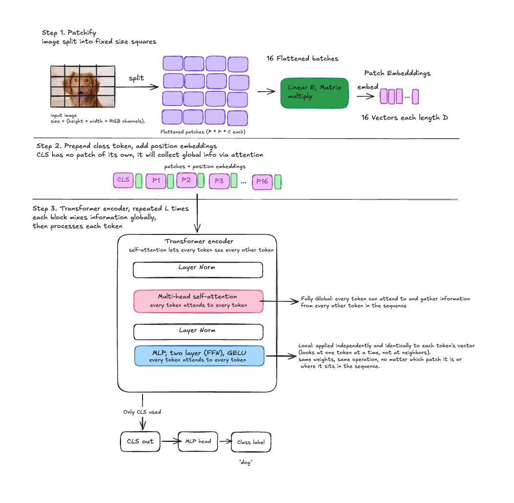

# An Image Is Worth 16x16 Words: Transformers for Image Recognition at Scale

Paper: https://arxiv.org/abs/2010.11929  
Code: https://github.com/google-research/vision_transformer

**Why it matters:** Proved transformers could replace CNNs for vision, unifying the architecture across modalities.

## TL;DR
Split an image into patches, treat them like words, feed them to a standard Transformer. It only works well with massive pre-training data because unlike CNNs, Transformers have no built-in assumptions about images so they have to learn everything from scratch.


## The Core Idea

The paper applies a standard Transformer directly to images, with the fewest possible modifications. They split an image into patches and provide the sequence of linear embeddings of these patches as input to a Transformer. Image patches are treated the same way as tokens (words) in NLP. Then they train the model on image classification in a supervised fashion.


## Inductive Bias — Why CNNs Have a Head Start

**Inductive bias** = built-in assumptions a model architecture makes about the structure of the problem, before it's seen any data.

### 1. Locality
CNN assumes that nearby pixels are related to each other and far-apart pixels usually aren't. This is why convolutional filters are small (like 3×3) and only look at a local neighborhood at a time.

### 2. Translation Equivariance
CNN assumes that if a feature (say, a cat's ear) appears in one part of the image, the same filter that detects it there should also detect it if it appears somewhere else in the image. Since the same convolutional filter slides across the whole image, the network doesn't have to separately re-learn "ear detection" for every possible position.

### ViT doesn't have this
Self-attention lets every patch interact with every other patch from the very first layer, with no built-in notion that nearby patches are more important, and no built-in assumption that patterns should behave the same way regardless of position. So ViT has to learn locality and spatial relationships from scratch, purely from data.

> With a small dataset, the CNN's baked-in assumptions act like a helpful head start. ViT needs to see a lot more examples to discover on its own that locality and spatial patterns matter — which is why ViT only pulls ahead once pre-training data scales into the tens or hundreds of millions of images. **ViT needs more data to train.**


## How It's Done

Naive application of self-attention to images would require that each pixel attends to every other pixel — way too expensive.

### 1. Splitting the image
Instead of feeding individual pixels to the Transformer (224×224 = 50,176 tokens, way too many and expensive), they chop the image into a grid of fixed-size squares, say 16×16 pixels each. That gives (224/16) × (224/16) = 14×14 = **196 patches**. Each patch is a small image of 16×16×3 = **768 raw pixel values**.

### 2. Linearly Embed
Each patch gets flattened into a single long vector of 768 numbers (16×16×3 = 768). That flattened vector is then multiplied by a learned weight matrix to project it into the Transformer's working dimension D (e.g. D=768 for ViT-Base).

```
Linear = matrix multiplication -> patch_vector × E
E = trainable matrix of shape (768 × D)
```

Basically: take the flattened patch and multiply by a learned matrix.

### 3. Classification Token
The Transformer outputs one vector per input token, so after processing it ends up with 196 output vectors (one per patch). Which one it should use to decide "this image is a dog"? There's no natural single best one — every patch only saw a piece of the image.

**The fix:** before feeding the sequence into the Transformer, prepend one extra vector that does **not** correspond to any image patch at all. It's just a free-floating learned vector — its values start random and get updated during training via backprop, exactly like any other model parameter.

Sequence goes from 196 → **197 tokens**: `[CLS, patch_1, patch_2, ..., patch_196]`

Because self-attention lets every token attend to every other token, as this sequence passes through the Transformer layers, the CLS token's representation gets updated by gathering information from all the patches via attention. By the final layer, the CLS token's output vector has effectively absorbed a summary of the whole image. That final vector is what gets passed into a small classification head (an MLP) to produce the actual class prediction.



### The Classification Head
The classification head is implemented by an MLP with one hidden layer at pre-training time and by a single linear layer at fine-tuning time — basically, depending on the training phase, the classifier on top of the CLS token is swapped accordingly.

**During pre-training** (training on the very big dataset):
```
CLS output → linear layer → GELU → linear layer → class logits
```
This gives the model more capacity to learn a fairly complex mapping from representations to a large number of classes. Since it's trained on a huge amount of data it can afford a more expensive head.

**During fine-tuning** (adapting to a smaller downstream task):
```
CLS output → one weight matrix → class logits
```
No hidden layer, no non-linearity. This layer is zero-initialized — starts at zero and learns from scratch during fine-tuning.

The reasoning: by fine-tuning time, almost all the thinking has already been done by the pre-trained encoder — the CLS token representation is already rich and well-structured. So we don't need a complicated head anymore, just a simple linear layer to map onto the new set of classes. Also less prone to overfitting on the typically much smaller fine-tuning datasets.

### Position Embeddings
The position embeddings are just a table of learnable vectors, one per sequence position, initialized randomly. At the start of training, embedding vector #5 has no idea it's spatially adjacent to vector #4 and vector #6 — it's just a random vector with an arbitrary index.

The model has to discover through training that position 5 is near position 4, near position 6, and two rows down from position 5+grid_width, purely by seeing how useful that information turns out to be for the task. After training, nearby patches did end up with similar position embeddings, and a row-column structure emerged. But that structure isn't given upfront like in a CNN — it had to be learned from data.


## Hybrid Architecture

The hybrid model changes only the very first step. Instead of feeding raw image patches into the linear projection E, you first run the image through a CNN (like ResNet), and use the CNN's output feature map as input to the patching process instead of the raw image.

**Why it helps:** CNN's feature map is already a compressed, spatially-downsampled representation of the image, where each spatial position summarizes a region of the original image and already encodes local patterns like edges and textures. So instead of patches of raw pixels, you're taking patches of this already-processed feature map. Everything downstream — the CLS token, the position embeddings, the Transformer layers — works exactly the same way as in plain ViT.

---

## Dataset Size Really Matters

Dataset size turns out to be very crucial for ViT. With small datasets, ViT actually underperforms ResNets of similar size, because it doesn't have those helpful built-in assumptions to fall back on. It only starts to match or beat ResNets once the pre-training data gets large enough (tens of millions of images and up) — at which point ViT can learn the relevant spatial structure from data more effectively than the CNN's rigid, hard-coded assumptions allow.